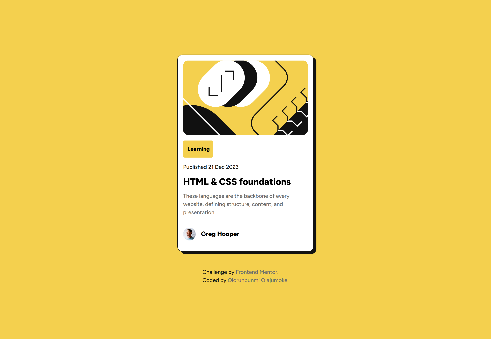
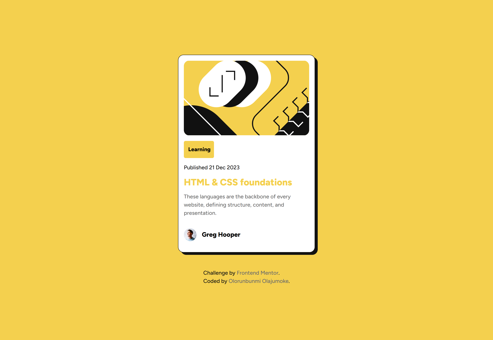
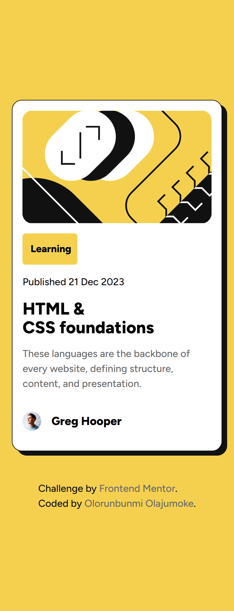

# Frontend Mentor - Blog preview card solution

This is a solution to the [Blog preview card challenge on Frontend Mentor](https://www.frontendmentor.io/challenges/blog-preview-card-ckPaj01IcS). Frontend Mentor challenges help you improve your coding skills by building realistic projects. 

## Table of contents

- [Overview](#overview)
  - [The challenge](#the-challenge)
  - [Screenshot](#screenshot)
  - [Links](#links)
- [My process](#my-process)
  - [Built with](#built-with)
  - [Useful resources](#useful-resources)
- [Author](#author)

## Overview

### The challenge

Users should be able to:

- See hover and focus states for all interactive elements on the page

### Screenshot

### Links

- Solution URL: [Github](https://github.com/olajay-pro/Blog-preview-card)
- Live Site URL: [Vercel](https://blog-preview-card-olajay-pros-projects.vercel.app/)

## My process

### Built with

- Semantic HTML5 markup
- CSS custom properties
- Flexbox

### Useful resources

- [Box Shadow Generator](https://cssgenerator.org/box-shadow-css-generator.html) - This helped me in generating the exct type of box shadow i needed without me distorting my code with trial and error.
- [CSS Reset](https://piccalil.li/blog/a-more-modern-css-reset/) - This is an amazing article which helped me understand css reset and its importance. I'd recommend it to anyone interested in learning this concept.

## Author

- Github - [Olorunbunmi Oljumoke](https://github.com/olajay-pro)
- Frontend Mentor - [@olajay-pro](https://www.frontendmentor.io/profile/olajay-pro)
